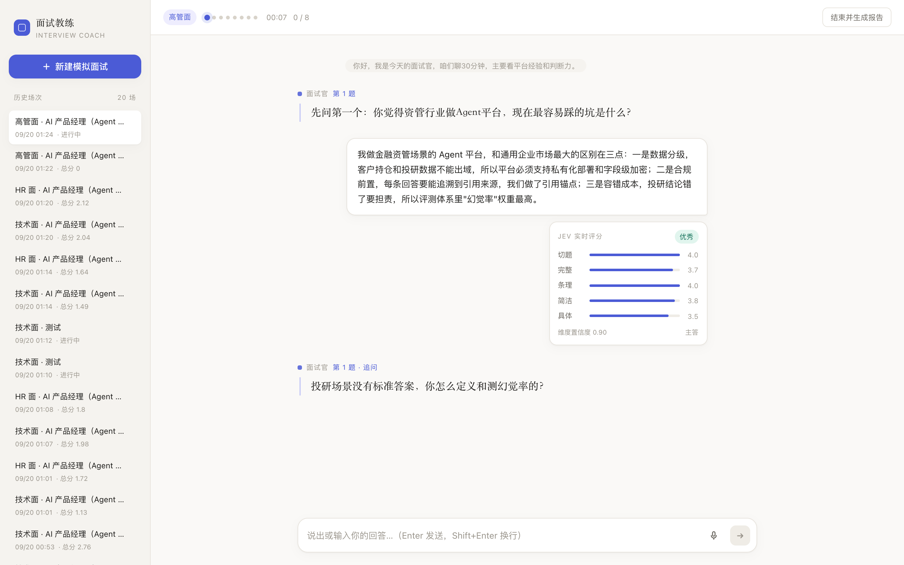
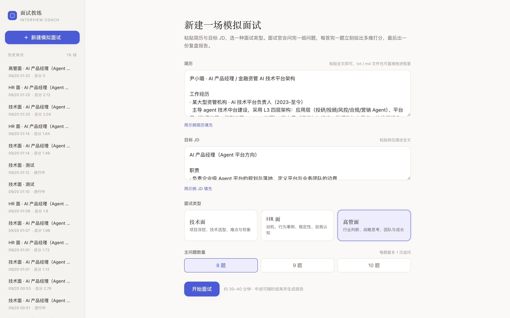
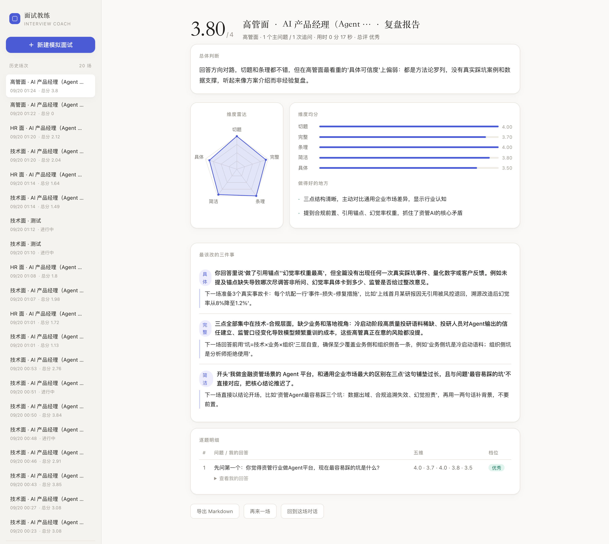

# Interview Coach · 模拟面试 Agent

> 真实 LLM 面试官 + JEV 快速测评引擎的双模块模拟面试系统。
> 上传简历与 JD，选一种面试类型，跟 AI 面试官完整走一轮 8–10 题的模拟面试——每答完一题，旁边立刻弹出五维打分卡，结束后生成带改进建议的复盘报告。

<p align="center">
  
</p>

## 核心特性

| | |
|---|---|
| 🎭 **三种面试人格** | 技术面（深挖项目与权衡）· HR 面（动机与行为事例）· 高管面（战略判断与成长性），出题基于你的简历与 JD 定制，不念题库 |
| ⚡ **JEV 实时测评** | 每次回答后约 1–2 秒弹出五维打分卡：**切题 / 完整 / 条理 / 简洁 / 具体** + 总评档位 + 置信度；低置信自动打灰、不进均分 |
| 🔁 **智能追问** | 回答偏短、缺要点或绕题时，面试官顺着细节追问（每题最多 1 次，整场上限 3 次，由后端状态机裁决，不信任模型自觉）；极短回答会在打分卡上标注"回答偏短，仅供参考" |
| 🎙️ **语音回答** | 本地 mlx-whisper 转写（Apple Silicon），录音 → 文字回填输入框，确认后才发送，数据不出本机 |
| 📊 **复盘报告** | 总分 + 五维雷达图 + 最该改的三件事（引用你的真实回答作证据）+ 逐题明细可展开，报告可导出 Markdown |
| 💾 **历史存档** | 全部场次、消息、评分、报告落 SQLite，重启不丢，随时回看 |

## 工作原理

```
┌─────────────────────────────┐      ┌──────────────────────────┐
│  面试官 Agent（MiniMax-M3）  │      │  JEV 测评（Decisions API） │
│  只负责提问 / 追问，禁止评价  │      │  只负责打分，并行不阻塞     │
└──────────────┬──────────────┘      └────────────┬─────────────┘
               │      两者并行，任一故障面试照常进行 │
               └──────────────┬────────────────────┘
                              ▼
                 FastAPI 后端（状态机裁决题量与追问）
                              ▼
                    SQLite（场次 / 评分 / 报告）
```

- **双模块强解耦**：面试官 LLM 与评分引擎互不感知、并行调用，单次往返 ~1.8s 同时拿到打分和下一题；JEV 故障时降级为本地启发式评分，面试永不中断。
- **JEV Composite Scoring**：一次请求并行 6 个原子判断（4 个 score + 1 个 noul + 1 个四选一 choice），按维度置信度均值做门控——答得差的题如实计分，不虚高。
- **成本可忽略**：一场 10 题全流程 LLM+JEV 总成本 ≈ **$0.0003**。

## 快速开始

```bash
# 1. 依赖（Python 3.10+）
pip install fastapi uvicorn httpx python-multipart
# 语音回答（可选，仅 Apple Silicon）：pip install mlx-whisper

# 2. 配置密钥（server/.env）
#    TEXT_MODEL_API_KEY / TEXT_MODEL / TEXT_MODEL_BASE_URL   ← 面试官 LLM（OpenAI 兼容端点）
#    TYPESAFE_API_KEY  / TYPESAFE_MODEL / TYPESAFE_BASE_URL ← JEV 测评引擎

# 3. 启动
cd server
./restart.sh          # 一键启动（自动处理端口占用，并校验进程加载的是最新代码）
open http://127.0.0.1:8821
```

浏览器打开后：粘贴简历与 JD（或点「示例填充」）→ 选面试类型 → 开始面试。打字或点麦克风语音回答均可。

## 测试

```bash
cd server
python acceptance.py        # 全量验收：三种面试人格各跑一场真实面试 + 持久化 + 报告 + 删除 + 语音 + 异常输入
python acceptance.py --asr  # 只测语音链路
python e2e.py               # 单场技术面端到端
python e2e.py --verify      # 重启服务后校验持久化
```

验收覆盖：题量状态机（8 题不多不少）、追问上限、收尾反问不计分、极短回答门控、复盘必须由 LLM 生成（三场文案不得雷同）、SQLite 持久化、历史列表与删除、语音转写准确、异常输入（400/404）。

## 界面

| 新建面试 | 实时评分 | 复盘报告 |
|---|---|---|
|  |  |  |

## 项目结构

```
interview-coach/
├── web/index.html          # 前端单页（原生 JS，无构建）
├── server/
│   ├── app.py              # FastAPI：面试官状态机 / JEV 调用 / 报告生成
│   ├── store.py            # SQLite 持久化（sessions / messages / evaluations / reports）
│   ├── asr.py              # 本地语音转写（mlx-whisper，可选）
│   ├── restart.sh          # 一键启动/重启（含代码版本自检）
│   ├── acceptance.py       # 全量验收（三种面试人格 + 持久化 + 语音 + 异常输入）
│   └── e2e.py              # 单场端到端测试
├── docs/
│   ├── 01-产品设计文档-PRD.md
│   ├── 02-开发规范-SPEC.md
│   ├── 03-设计语言与参考.md
│   └── screenshots/
└── data/                   # 运行时生成（gitignore）
```

## 设计说明

界面遵循一套克制的编辑感设计语言：奶油白底 + 衬线标题 + 单一靛蓝强调色 + 1px hairline 边框。参考了 Claude 的 Artifacts 分栏（打分卡挂在回答旁而不淹没对话流）、Perplexity 的"给分必须给依据"、Linear 的精准细节。详见 [docs/03-设计语言与参考.md](docs/03-设计语言与参考.md)。

## 隐私

- 简历 / JD / 回答 / 录音仅存在本机 SQLite 与临时目录，不上传任何第三方。
- 语音转写完全本地推理（mlx-whisper），音频处理后即删除。
- 唯一的外部调用是面试官 LLM 与 JEV 测评 API（各自的密钥自备）。

---

*Docs: [PRD](docs/01-产品设计文档-PRD.md) · [SPEC](docs/02-开发规范-SPEC.md) · [设计语言](docs/03-设计语言与参考.md)*
